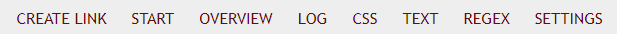
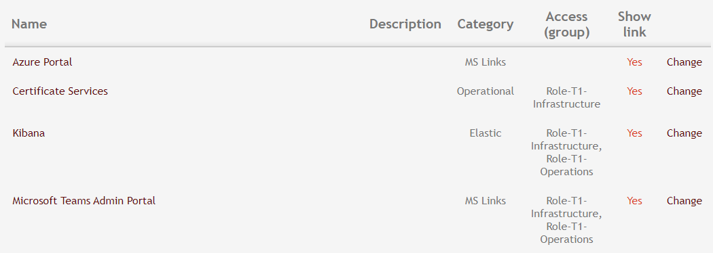
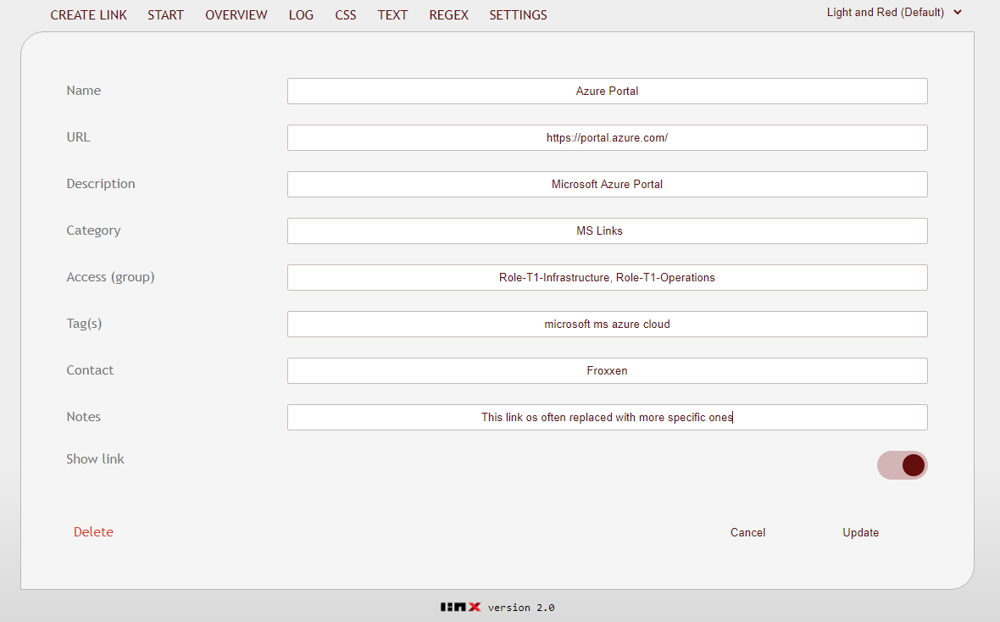
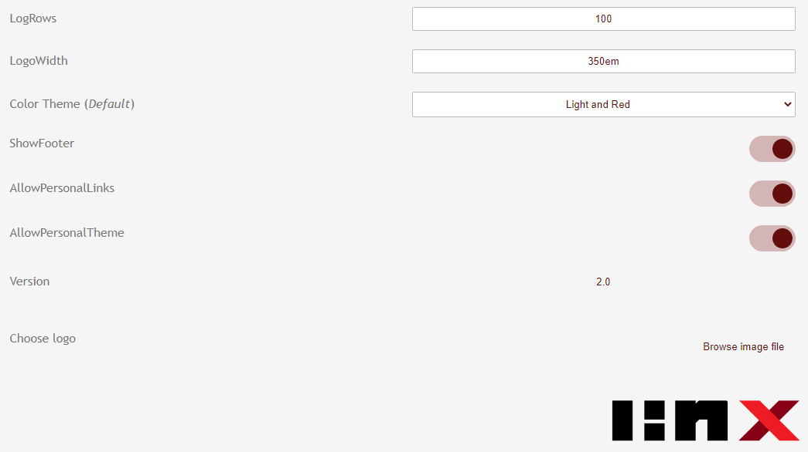
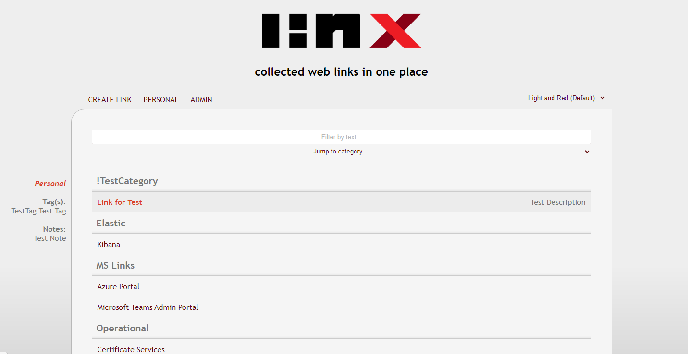
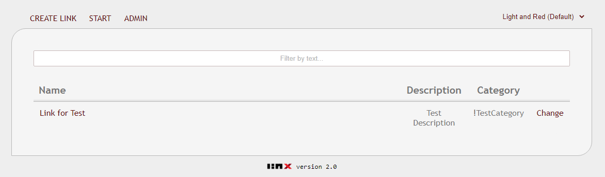
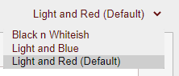
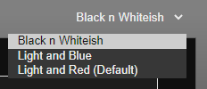
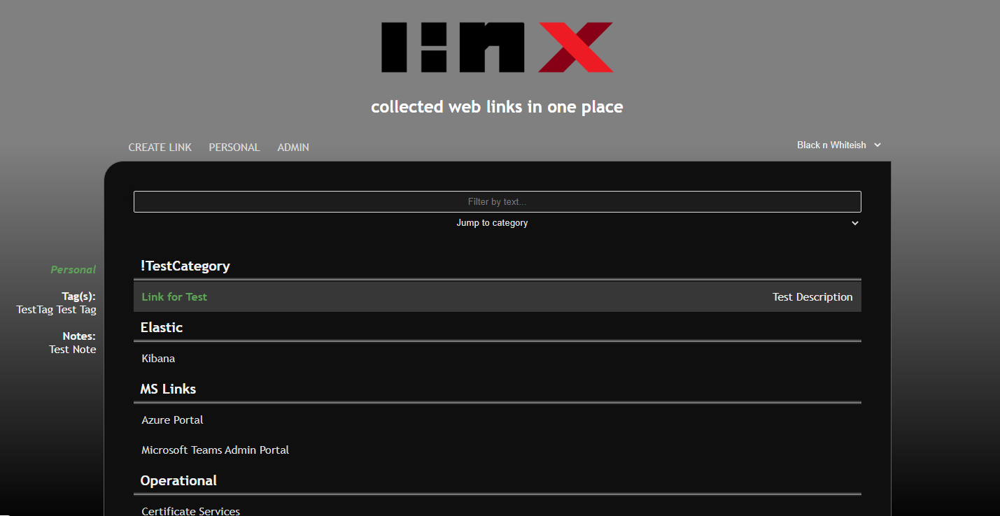

# Linx
An *on-prem* web site for web links, based on RestPS

## DESCRIPTION

*A **strong** recommendation is always to test new things in a lab environment, if such exist, first hand ;) The information provided here is 'as is' until otherwise mentioned!*
 
Ever felt confused when joining a new firm about where to find things? Some things are known by him, her, that and/or maybe even this...
No worries, now if you have some Windows server just idling you can quite easily gather all these pieces in one place and share the knowledge with others.
This place would in this scenario be, you've probably already guessed it, Linx.

## FEATURES
- Enable/disable use of personal themes, currently 3 different themes available

- Enable/disable use of personal links/categories

- Categorize, tag and filter links to find them fast

- Role bases Access Control *per* link

- Role based Access Control for editors and admins

- OU based access control for regular users

- Customize (*some*) CSS in web interface

- Customize regular expressions used to your need

- No database needed, all stored locally (*with pro's and con's coming with that approach*)

- Support for multiple languages, currently English and Swedish

- Fully customizable (*as long as you know your PS*)

- Add notes and a potential contact to each link

- Uses "*System.Net.HttpListener*"

- And more...

## FUTURE CHANGES
- Try to convert a JQuery function to JavaScript (*that collapse/expand Headers onClick*), without knowing either that well and online converters does not seem to either...

## CHANGE LOG

#### version 2.0.0 (2021-20-24)
- Version *2.0* released

<details><summary>Show</summary>

#### version 0.0.1 - 1.9.9 (2021-05-30 - 2021-10-24)
- Undocumented           
</details>
  
## REQUIREMENTS

<details><summary>Show</summary><br>

For everything to work as expected the following requirements should be met:

**TL;DR**
- Local Administrator membership to setup the web site

- Issued web certificate from internal CA

- Tested and developed in PS 5.1

- A Windows Server joined to Active Directory with mentioned PS version

**Specifics**
- Powershell version 5.1 *(not tested in other versions, but might work)*
</details>

## PRE-INSTALLAION
- Download this repo and unpack the folder "*Linx*" to a Windows Server under ex. "*C:\RestPS\Linx*" (*if you change the path you need to modify "endpoints\Routes.json"*)

- Download [NSSM](https://nssm.cc/download) and copy the 64-bit version of "*NSSM.exe*" to "*C:\Program Files\NSSM\*"

- Create an internal DNS-record, ex. "*linx.domain.local*"

- Issue a web server certificate according to normal routine and add to "*Personal*" \ "*Certificates*" in "*certlm.msc*"

- Create a gMSA service account (*with no more than "Domain user" rights, except the need to "*Log on as a service*" on this specific server*)

- Install and test the gMSA service account (*Requires "the feature "Active Directory module for Windows Powershell", "install-adserviceaccount gmsa-linx"  and "test-adserviceaccount gmsa-linx*" )

- Create two security groups, one for Edit- and one for Admin access to Linx (*and add sufficient members to those*)

- Makre sure the TCP port that will be used, usually 443, is open in sufficient firewalls, ex. between your client/this server

## INSTALLATION
- Run the script "*bin\Set-Service.ps*" in an elevated Powershell prompt (*assign different parameters if NSSM or Linx paths are changed*)

- Open "*services.msc*" elevated and find the service "*Linx*"
   
   - Right-click and select "*Properties*" \ "*Log on*" \ "*This account*"
   
   - Enter the gMSA service account, clear the password fields and save by pressing "*OK*"

- Open an elevated command prmopt and run these two commands (*this is included in RestPS originally, but don't want the requirement of being a local admin to run it*):
   
   - Replace FQDN, Port and Thumbprint used to match your environment:
   
     ```netsh http add sslcert hostnameport=linx.domain.local:443 appid={2a81d04e-f297-46a6-b17a-3580fa3d91a5} certhash=THUMBPRINT certstorename=My```
   
   - Replace FQDN, Port, Domain and the gMSA service account used to match your environment
   
     ```netsh http add urlacl url="https://linx.domain.local:443/" user="DOMAIN\gMSA-Linx$"```
 
- Configure "*base_settings.json*" to match your environment:
   
   - *ServerURL:* https://linx.domain.local (*post https:// must match CN or SAN in certificate*)
   
   - *ShortURL:* linx.domain.local (*FQDN*)
   
   - *Domain:* DOMAIN (*short name of the domain*)
   
   - *SSLThumbprint:* Check your certificates thumbprint and paste it here
   
   - *AdminGroup:* Common name of the group containing Linx-administrators
   
   - *EditGroup:* Common name of the group containing Linx-editors (*a.k.a. admins without sugar*)
   
   - *OU_Admin:* Distinguished name for the OU which holds your administrative accounts, if those shall have access to Linx
   
   - *OU_Group:* Distinguished name for the OU containing the Admin and Edit Linx groups
   
   - *OU_User:* Distinguished namr for the OU containing the standard users of Linx

    *Port and Language could also be specified if necessary...*

 - Set file and folder permissions for gMSA service account
   - gMSA minimum permissions (*recommended*):
   
      - "*Delete*" files under "*bin\Personal*"
   
      - "*Modify*" on the following subfolders and files:
      
         - bin (*folder*)
      
         - images (*folder*)
      
         - lang (*folder*)
      
         - logs (*folder*)
      
         - settings (*folder*)
      
         - style (*folder*)
      
         - base_settings.json

   - gMSA sloppy ACLs (**not** *recommended*):
   
      - "*Full Control*" on Linx subfolders and files
 
- Start the service and go to Linx from another machine to start using it

## POST-INSTALLATION
- Every now and then your certificate will expire, then:
   
   - Order a new certificate according to your local routines
   
   - Open "*certlm.msc*" and add the certificate to "*Personal*" \ "*Certificates*"
   
   - Remove the old certificate in the same store (*recommended*)
   
   - Open an elevated command prompt and run (*changes values to match your environment*):
   
      ```netsh http delete sslcert hostnameport=linx.domain.local:443```
      
      ```netsh http add sslcert hostnameport=linx.domain.local:443 appid={2a81d04e-f297-46a6-b17a-3580fa3d91a5} certhash=THUMBPRINT certstorename=My```
   - Open "*base_settings.json*' in an elevated editor and change "*SSLThumbprint*" to the one matching the new certificate
   
   - Restart the service

## TROUBLESHOOTING
- The service won't start:
   - Verify that the minimum ACLs are set accordingaly
   
- The service *still* won't start:
   - Run "*Start-Service.ps1*" in a Powershell prompt started as the gMSA service account for further analysis

## INSTRUCTIONS

### MENU

When you start the site for the first time you will have access to this menu if you login as Admin.
The tab "*Admin*" will show if you have Edit permissions as well, but will be hidden for regular users.
Selection of themes (*to the right*) is also an available setting to turn off if you desire for all users.


### ADMIN MENU

Go to the "*Admin*" link and this bar will show up, the tabs for "*CSS*", "*TEXT*", "*Regex*" and "*SETTINGS*" are only visible for Admins, not editors.



## ADMIN PAGE

On the admin page you can see a list of all links created (*excluded all personal ones though*) and sort by column



### EDIT LINK

When you edit a link, either through personal or admin view, it will look like this (*Role and Contact is not available for personal links though*)



### SETTINGS

In "*ADMIN*" \ "*SETTINGS*" you can confgiure such settings as what language will be used for Linx, if the footer will show or not, toggle the availability of personal links and themes and set the default theme for all users



### PERSONAL LINKS

The personal links is marked in another color than the public ones and it will even show in the tooltip on the left-hand side



When one or more personal links are available it will show up on the menu of the Start page and you can edit and remove your links from that page



### THEME SELECTION (*ON BY DEFAULT*)




### THE "*BLACK AND WHITEISH* THEME

Here is just a glimpse of one of the default themes



## GREETINGS
A **big thanks** to [Justin S](https://github.com/jpsider) for the development of RestPS,
an old version is the corner stone of this project.
